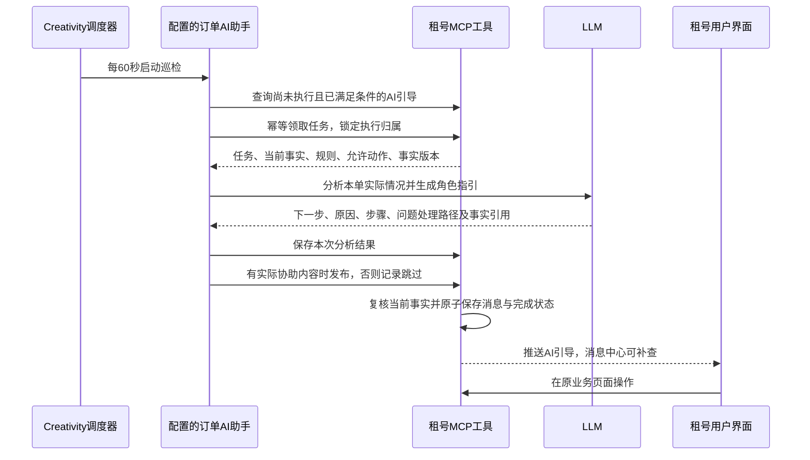

# 租号订单 AI 协助方案

2026年10月9日；状态：本机租号服务使用 test 的 MySQL/Redis，Creativity 开发环境通过配置的 Agent、六个 MCP 工具和每 60 秒巡检计划完成实际订单联调。订单 `ORD-DF-20261009-000006` 的支付协助由真实模型分析一次，保存、复核发布成功；运行 `run_a40fecdcaf854913b63848255ff086fb` 已完成。租客支付页及消息中心均显示「AI助手生成」，正文说明支付处理中、避免重复支付及凭证核查路径。其后三轮巡检均未再次调用模型，源端仍为一条支付协助任务和一条对应消息。微信支付二维码可生成，本次未实际付款，支付后交号、确认可玩及归还退款流程未做完整页面验收。

本轮修复了 MCP 凭据变更后原工具无法重新绑定、UTC 业务时间被 JDBC 上海时区偏移、支付失败场景漏选、重复支付查询误使事实过期的问题；同时调整 Agent 上下文额度，强化中文正文、结构化引用和 JSON 输出要求。验证通过：16 项隔离 MySQL 协助测试、23 项 PostgreSQL/Redis 集成测试、前端类型检查/lint/构建及初始化 SQL 归档校验，未使用 H2。联调中的旧失败任务和已评估任务保持原账本，未重新分析或补发；其中存在模型输出结构校验失败样例，严格校验和零重试继续生效。员工专属视图、外部通知和主动问答仍为后续阶段。装配与容量边界见 [配置说明](../../examples/agents/rental-order-guidance/README.md)。

已通过浏览器验证 AI 消息可跳转到本单。支付结果随后变为失败时，订单页将原支付协助标为「历史协助」，提示订单情况已变化、以当前办理入口为准；不会把旧内容当作当前结论，也不重新占用该类型的分析资格。

本文是业务接入方案，不新增 Creativity 的租号专用模块。公共开发规范引用 [rule.md](../../../rule.md)，平台边界引用 [API 与 MCP 接入](../../../需求文档/14-业务接入与适配.md)，工具策略引用 [工具管理](../../../需求文档/10-工具管理.md)，资源配置遵循 [资源管理简化修改方案](../../../需求文档/18-资源管理简化修改方案.md)。

2026年10月8日明确的实施边界：Creativity 通过配置接入本场景。“订单 AI 协助助手”是渠道下的一条 Agent 配置；MCP 地址、业务工具名、步骤绑定、提示词、Skill、模型、执行策略和巡检周期均为配置。租号规则与消息落地在 gamerental-service 实现。若通用平台能力缺失，单独补齐通用配置与执行机制，不建立租号专用执行入口、模块、表、路由或代码分支。

## 1. 产品目的与职责边界

**产品目的：帮助用户理解当前订单的实际处境，弄清操作条件、处理顺序和问题解决路径，完成正确的下一步。**

AI 承担基于本单事实的分析、解释和协助；催支付、催交号、催确认等催办职责全部由系统消息承担。对固定通知换一种说法、增加客套解释或要求“尽快处理”，均不属于有效的 AI 协助。

每个订单的每种 AI 引导只执行一次，由 LLM 分析当前事实、阻塞原因和合法操作。AI 与系统消息分别记录执行和发送状态，可以同时存在；AI 是否有价值，取决于它帮助用户解决了什么具体理解或操作问题。

| 内容 | 租号系统消息 | AI 流程引导 |
| --- | --- | --- |
| 职责 | 事件通知、到期提醒、待办催办 | 解释本单情况，协助判断操作条件、先后顺序及问题处理方式 |
| 内容来源 | 业务事件、定时规则、系统模板 | LLM 分析授权范围内的当前业务事实与规则 |
| 执行次数 | 沿用自身业务规则 | 每个订单、每种 AI 引导一次 |
| 相互关系 | 发送或已读不占用 AI 引导名额 | 不抑制系统消息，也不因系统消息已发送而跳过 |
| 界面来源 | 系统通知 | AI助手生成 |

首期采用「租号提供待协助场景和订单上下文 → Creativity 按配置定时巡检 → 领取尚未执行的协助 → LLM 分析具体问题与处理方式 → 保存评估结果，有实际协助内容时复核发布」的方式。空巡检不调用模型，实际 AI 引导必须有 LLM 分析，不以模板替换后计作 AI 已执行。

| 问题 | 建议 |
| --- | --- |
| 租号是否需要主动调用 Agent？ | 后台巡检无需主动调用；将来用户点击“问 AI”时，可以由租号后端调用统一 Agent API。 |
| 调度由谁负责？ | Creativity 通用调度器启动配置好的 Agent，Agent 调用租号 MCP 工具。 |
| 租号工具返回什么？ | 真实订单及相关流程事实、适用规则、合法接收方、允许动作和依据，不提前写死最终引导话术。 |
| LLM 做什么？ | 分析本单所处情境和阻塞，排列操作顺序，生成有依据的解释与指引。 |
| 谁改变订单状态？ | 租号现有业务服务；AI 不代付、代交号、代确认、代退款或裁决。 |
| 谁发送并展示引导？ | 租号复用消息中心及推送链路，保存独立的 AI 引导记录并明确标注来源。 |

业务期限、权限、计租和资金结果仍由租号服务判定。LLM 可结合这些事实推理操作顺序和解释原因，不能创造新的交易条件或将未核实的结果当作事实。

### 协助内容的判断标准

每项有效协助需要明确四件事：本单已经发生的相关事实、用户当前面临的具体问题、建议的操作或等待路径、这些建议成立的依据。输出长度和口吻不作为价值判断，简短但准确的说明也可以有帮助。

| 本单实际情况 | AI 应提供的协助 |
| --- | --- |
| 已有支付尝试，机构结果尚未确认 | 解释结果仍待核实、在哪里查看进度，以及什么情况下应联系平台；不让用户再次付款 |
| 号主已完成扫码，但必要交付佐证缺失 | 根据工具返回的真实缺项，说明需补什么材料和提交位置；不要求重做已完成的步骤 |
| 已申请取消，但本单真实交号已经发生 | 解释为什么仍需先实际回收、补齐终态材料并核清费用，指明当前哪一方可做什么 |
| 退款仍在等待机构回执，用户没有可执行动作 | 解释当前处理到哪里、为什么需要等待、在哪查看后续结果；避免制造无意义的操作 |

没有充分事实时，先通过授权工具补全；仍无法判断就说明具体缺失，不编造处境或步骤。只有“请及时支付/交号/确认”或通用客服套话时，不发布 AI 引导。LLM 可以返回 `NO_ADDITIONAL_HELP`，保存本次评估结果并结束该类型，不为增加消息量强行生成内容。

## 2. 已有能力与真实缺口

| 能力 | 当前依据 | 本次处理 |
| --- | --- | --- |
| MCP 协议和应用鉴权 | `/mcp`、`/mcp/token`、AI应用接入配置和 `McpTool` 扩展点已存在 | 新增待引导查询、任务领取、上下文查询、结果保存和发布工具；当前生产源码没有业务工具实现 |
| 周期运行 | `AutomationService`、`ScheduleCreate` 支持间隔计划，最小 60 秒 | 首期配置每分钟巡检，业务引导类型与流程不写进调度器 |
| 业务事实投影 | 七步履约进度已提供来源、下一步和截止等信息 | 批量补充模型所需事实、阻塞、规则及可操作项，不局限于单个订单状态 |
| 系统消息及推送 | `user_notice`、`OrderNoticeService`、WebSocket、五分钟支付提醒及各类事件通知已存在 | 复用基础消息能力；系统通知与 AI 引导使用独立执行记录和去重范围 |
| AI 单次执行账本 | 当前缺少按订单和引导类型记录的 AI 执行结果 | 在租号侧建立任务与结果，防止重复轮询、多 Agent 或模型版本变化后再次执行 |
| 自动写工具 | 写入当前逐次进入审批，未知结果进入核查暂停 | 补齐通用预授权幂等写入与自动结果核查配置，支持领取、结果保存和发布 |
| MCP 可信上下文 | 应用访问校验当前不返回业务工具所需的已鉴权应用上下文 | 将已验证应用、环境、渠道与工具权限传入业务层，不直接采信模型参数或 `_meta` 声明 |
| AI 展示 | 当前消息契约没有 AI 来源与引导类型 | 扩展消息投影、类型过滤、WebSocket 和前端 AI 标识 |

上述平台能力补齐采用通用实现，租号接入仍通过 MCP、工具、Skill、Agent 和定时计划配置完成。

## 3. 总体流程



租号内部根据业务事实维护待引导事项，无需主动调用 Agent。调度只寻找尚未执行的任务，不在每轮重复分析全部订单。订单可以持续多天，执行记录保存在租号业务端，运行过程保存在 Creativity，不依赖常驻 Agent 或模型记忆去重。

系统消息通过原业务链路独立触发，不出现在 AI 任务领取、执行名额或发布去重判断中。以后接事件消费时仍使用同一 AI 任务键；当前 MCP 的单次 SSE 响应不是订单事件订阅。

## 4. 全流程用户协助场景矩阵

下表每行是一个预先登记的 AI 引导类型。对同一订单每种类型只执行一次；只在条件满足且本单仍需要该引导时触发，不强制把所有类型发给每一笔订单。系统消息是否发送、是否已读不影响这里的触发资格。

矩阵用于列出各阶段可能需要解决的用户问题，不是到达每个状态就必发一条 AI 消息的清单。每项输出必须结合本单事实提供有用的解释或处理路径；只能复述状态或催办时，保存“已评估，无额外协助内容”并跳过发布，同类型不反复分析。

类型是稳定的业务语义，不能按时间、账单版本、重试轮次或模型版本动态造新类型重复执行。金额、期限、异常分支和具体下一步由本次真实上下文及 LLM 分析决定。

| AI 协助类型 | 面向谁 | 可进入分析的条件 | 需要帮助用户理解或解决的问题 |
| --- | --- | --- | --- |
| 支付引导 `PAYMENT_GUIDANCE` | 租客 | 支付窗口内待支付或支付失败，所需支付事实已齐备 | 解释本单租金、押金和其他应付项目；结合支付尝试判断应继续正常支付、查看结果还是等待核实，避免重复付款；失败时依据本单机构结果说明核查路径；仅“请支付”不构成协助 |
| 履约群引导 `GROUP_GUIDANCE` | 需要群履约的双方 | 本单确实需要群履约且入口已就绪 | 为什么需要进群、各方先做什么、入口异常时找谁；账密流程无需进群时不触发 |
| 交号引导 `HANDOFF_GUIDANCE` | 号主 | 已正式支付且仍需完成交付 | 结合本单账密/扫码方式和已完成动作，说明还缺哪些交付材料、如何准备和提交、异常由谁处理；仅“请交号”不构成协助 |
| 确认可玩引导 `PLAYABLE_CONFIRMATION_GUIDANCE` | 租客 | 已有真实交付事实且尚未确认可玩 | 当前交付内容、需要核对的事项、何时可以确认、哪些问题应先反馈，解释本单适用的确认期限 |
| 到期准备引导 `RENT_END_PREPARATION_GUIDANCE` | 租客及需准备收号的号主 | 到达配置的到期准备窗口，仍在租用 | 本单结束时间、归还所需材料、停止使用与回收的准备顺序；已提前结束则跳过 |
| 到期收号引导 `ACCOUNT_RECOVERY_GUIDANCE` | 号主；租客可获得相关说明 | 已到期且尚未完成实际回收 | 当前缺少哪些回收步骤、如何提交终态材料、双方各自责任；不能把系统到期当作已收回 |
| 归还核对引导 `RETURN_REVIEW_GUIDANCE` | 号主 | 租客已提交归还且仍需号主核对 | 对照本单清单解释应核对的资产与证据、差异如何反馈、超时后由谁处理 |
| 终态材料引导 `TERMINAL_MATERIAL_GUIDANCE` | 号主或经办人员 | 已实际收回但必要终态材料不齐 | 具体缺项、提交顺序及对后续核算的影响；不补造租客归还或延长计租 |
| 耗材账单引导 `CONSUMABLE_BILL_GUIDANCE` | 租客 | 本单存在正式有效的非零耗材待处理账单 | 解释真实费用依据、已付与待付、查看明细和异议路径；后续账单改版不再次执行本类型 |
| 取消与终止引导 `CANCELLATION_TERMINATION_GUIDANCE` | 本单相关当事方或经办人员 | 进入有效的取消、拒交或协商终止处理流程 | 根据是否已真实交号分析应先回收、补证、等待审核还是查看退款，避免承诺立即退款 |
| 争议处理引导 `DISPUTE_GUIDANCE` | 有权参与的当事方/经办人员 | 存在正式争议待处理事项 | 解释争议阻塞了什么、仍能做什么、各方处理路径，不替代裁决 |
| 补证引导 `EVIDENCE_GUIDANCE` | 有补证义务的一方或双方 | 存在正式、未完成的补证要求 | 当前所需证据、可靠时间、提交位置和期限；多项补证按当前范围统一分析，后续补证轮次不重发本类型 |
| 复验与协调引导 `REVIEW_COORDINATION_GUIDANCE` | 当前有权处理的用户/经办人员 | 正式进入复验或人工协调且需要说明 | 当前处理方、待核实材料、等待和操作顺序，不自行解除业务阻断 |
| 押金观察期引导 `DEPOSIT_OBSERVATION_GUIDANCE` | 双方 | 观察期实际开始 | 本单观察范围、真实截止、有异议如何提出、为何可能尚不能退押；不再追加同类型临期引导 |
| 退款分账引导 `FUNDS_PROGRESS_GUIDANCE` | 用户；适用时包含财务经办视图 | 本单进入退款/分账处理且需要说明 | 根据真实资金结果区分等待机构、材料缺失和需财务核查；不把请求发起当作成功 |
| 完成说明 `COMPLETION_GUIDANCE` | 双方 | 订单正式完成/关闭且具备可靠结果 | 解释最终结果、可查看的明细及仍合法存在的独立后续事项，不反向阻塞关单 |

同一类型需要面向双方时，一次逻辑分析生成各角色可见的指引，共用同一任务。消息可分别投递到合法接收人，但不能因增加接收人而重新执行同一类型。各视图只使用该角色有权看到的事实，避免向另一方泄露专属资料。

引导类型、触发窗口、角色与上下文契约由租号业务工具提供；表达要求和分析流程通过 Skill/Agent 配置。到期准备窗口可建议提前 30 分钟，短租适当缩短；这些是触发建议，业务期限继续读取本单正式规则，系统五分钟支付提醒保持独立。

## 5. 待办、AI 执行与工具契约

### 5.1 租号保存的最小业务模型

建议独立保存 AI 引导任务和分析结果，消息仍使用 `user_notice`。业务唯一口径为「部署环境 + 订单稳定标识 + AI 引导类型」；服务端通过事务与互斥保证逻辑唯一，不依赖数据库唯一约束。

| 对象 | 关键内容 | 用途 |
| --- | --- | --- |
| 业务行动项 | 当前订单事实、角色、可操作项、期限、阻塞与事实版本 | 描述仍需处理的业务；已读或 AI 已执行不代表业务完成 |
| AI 引导任务 | 订单、稳定引导类型、触发条件、任务状态、领取租约及代次、分析尝试引用 | 同单同类型只建一个逻辑任务，重复进入阶段仍复用原记录 |
| AI 分析结果 | 任务、事实快照及引用、生成方式、模型/提示词版本、分角色内容、保存时间 | 保存一次分析成果，发布和投递重试复用原结果 |
| 投递记录 | 任务、已验证接收方、消息标识、渠道和投递状态 | 一份结果可投递到本次规定的接收方，各自最多一条站内消息 |
| 工具执行回执 | 已鉴权应用、环境、operation_key、参数摘要、逐项结果 | 支持领取、保存和发布超时后的核查 |

AI 执行键不包含接收人、订单版本、账单/案件版本、Agent、模型、提示词或策略版本。这些字段用于范围校验和审计，改变它们不能重置一次性名额。引导类型编码长期稳定；停用、改名或更新配置也不能被当作新类型重新执行。

当前实现通过有界扫描发现仍适用的候选，领取时在订单锁内复核并登记唯一任务；没有在全部订单状态机中增加任务写入。已登记任务永久排除再次分析，SAVED 任务优先恢复发布。即使消息过期、已读或用户清空消息，也保留满足一次性判断所需的最小执行记录；执行账本保留期间不得通过删除消息重新触发。

建议任务状态包括待处理、已领取、分析中、结果已保存、已发布、已跳过、执行失败、结果待核实。“已评估但无额外协助内容”是已跳过的一种终态，保留分析依据并占用本类型的单次执行记录，不再周期性分析。任务领取发生在 LLM 调用之前，防止两个调度同时分析；租约到期必须先核查原执行，不等于可以重新调用模型。成功结果只接受一次，旧租约持有者不能覆盖新执行者的记录。

“只执行一次”按同一业务任务控制：已生成的有效结果复用，已发布不再分析或发送。已知失败且未产生有效结果的有限技术重试仍属于原任务，不增加业务轮次；LLM请求结果未知时先核查，不能盲目再次生成。外部模型请求无法仅靠本地锁保证物理调用绝对一次，系统应保存调用与恢复状态，未能核实则转人工处理。

租号没有平台租户概念，本方案不恢复订单/用户表的 `tenant_id` 或普遍增加平台 `channel_id`。Creativity 继续按渠道隔离；租号现有 MCP 应用以 `channel_code` 绑定调用来源，合法消费者与员工范围由业务权限确定。

### 5.2 首期 MCP 工具

以下六个业务工具已注册，受专用应用授权和功能开关限制。查询和任务管理支持一至二十项的有界批量；当前 Agent 样例一次只领取一项，源端批量加载事实。主体委托复核仅在后续采用用户委托时需要。

| 工具 | 影响类型 | 输入与输出要点 |
| --- | --- | --- |
| `rental_assistant.list_pending_guidances` | `READ_ONLY` | 查询已满足条件且尚未执行的引导，返回任务、类型、业务概况和观测时间；当前为有界队列前缀，不提供分页游标，不占用执行名额 |
| `rental_assistant.claim_guidances` | `IDEMPOTENT_WRITE` | 按候选任务幂等领取，服务端返回已取得的任务、当前上下文和租约代次；已执行/在途任务不再派发 |
| `rental_assistant.get_guidance_contexts` | `READ_ONLY` | 批量读取任务当前事实、适用规则、合法动作、角色可见范围和已保存结果，供分析前补全或恢复核查 |
| `rental_assistant.save_guidance_results` | `IDEMPOTENT_WRITE` | 保存带事实引用、上下文版本及角色视图的 LLM 结果，核验执行归属与合法性；重复提交返回原结果，不同内容不能覆盖 |
| `rental_assistant.publish_guidances` | `IDEMPOTENT_WRITE` | 按已保存结果发布，发送前复核当前事实；接收方和入口由业务端确定，原子写入消息、任务完成状态和回执 |
| `rental_assistant.get_operation_status` | `READ_ONLY` | 按 operation_key 查询原操作的 `SUCCEEDED / NOT_EXECUTED / UNKNOWN` 及逐项回执 |
| 主体/应用授权复核工具 | `READ_ONLY`，基础设施专用 | 采用主体委托时使用通用 subject review 契约，模型不能自行选择执行主体 |

任务、领取、结果保存和发布都是业务工具契约，Creativity 仅通过配置绑定，不实现订单级去重规则。调用身份、租约、operation_key、AI来源与执行轨迹由可信运行上下文和源端校验确定，不允许模型更换。系统消息使用自己的类型与记录，不调用 AI 执行账本占用名额。

提供给 LLM 的上下文至少包含：当前阶段、已完成事实、未完成事项、交付方式、正式期限、相关账单与资金状态、争议/复验/补证、可执行动作、角色可见范围及依据引用。不能只提供一个订单状态或预写好的话术让模型换词。

LLM 输出的业务结构建议如下（内容仅用于说明结构）：

```json
{
  "guidance_id": "guidance_example",
  "lease_generation": 1,
  "assistance_decision": "GUIDE",
  "fact_revision": "源端返回的上下文版本",
  "assessment": "根据本单实际交付情况，需要帮助租客核对可玩条件",
  "views": [{
    "role": "TENANT",
    "user_problem": "如何判断本单已交付账号可以确认开租，发现不一致时怎么处理",
    "situation": "本单已交付，尚待实际核对是否可玩",
    "next_step": "打开交付信息，先完成登录和账号核对",
    "reason": "确认可玩应以实际核对结果为依据",
    "steps": ["查看本单交付信息", "核对账号及已发布资产", "正常则按页面确认，有问题先反馈"],
    "problem_path": "使用本单问题反馈入口提交实际遇到的情况",
    "action_codes": ["VIEW_ORDER"],
    "evidence_refs": ["工具返回的实际交付事实引用", "工具返回的本单确认规则引用"]
  }]
}
```

`assistance_decision` 取 `GUIDE` 或 `NO_ADDITIONAL_HELP`；后者保存无额外协助价值的评估理由，结束原任务且不生成用户消息。`GUIDE` 必须关联实际用户问题、业务事实及处理路径。该判断是 Agent 配置的通用输出契约，平台核心不增加业务判断分支。

LLM 负责生成解释与操作步骤，源端确定性核验执行归属、动作、事实引用存在性、事实版本和角色范围。当前没有逐句金额/期限证明或事实占位替换器，不能把 Schema 校验等同于自然语言事实正确性；实际模型启用前须以成对业务样本验收内容质量。校验失败不得发布或以模板伪装成 AI 完成。

`fact_revision` 覆盖本次引导相关的订单、交付、账单、案件、回收和规则事实。它用于判断内容是否过时，不参与单次执行键。领取时固定完整事实快照；领取后关键事实变化导致指引不适用，保存或发布时跳过该结果，不自动重做同类型分析。下一种尚未执行的引导可按其条件独立触发。

发布业务结果区分已发布、原结果已发布、事实过期跳过、任务失效、需核实、可重试失败。批次允许部分成功，技术成功与业务发送结果分别记录。相同请求键不同内容拒绝；不同 run 的请求键也不能绕过订单和类型的单次执行记录。

`NOT_EXECUTED` 只在确认原操作未执行且没有在途操作时返回。已开始而结果未知时返回 `UNKNOWN`。源端控制批量条数与字节数，遵守 MCP 请求/响应和平台工具结果上限；模型不读取交付密码、验证码、原始账密或无关证据正文。

### 5.3 无人登录时的授权

后台巡检使用经管理员授权的服务能力，不借用租客或号主的登录 Token。首期沿用现有管理授权创建计划，并为其绑定专用 MCP 应用；租号对该应用显式授予“查询与领取 AI 引导任务、保存分析结果、发布受限引导、查询自身回执”的权限。需要覆盖全站订单时，也必须是明确的业务授权范围，而不是因为 appId 能鉴权就自然获得全站权限。

调用时将已验证 Token 对应的应用、渠道、环境和应用授权传入业务工具，再核对 `creativity.identity`。元数据声明与应用绑定不一致即拒绝；普通 `_meta` JSON 本身不构成可信身份。工具根据行动项解析实际接收人，不能将收件人冒充为本次执行主体。停用应用、撤回授权或暂停 Agent 后，新调用应被阻断。

若后续改为独立服务执行身份，需给通用调度补齐显式身份绑定及当前权限复核；当前计划保存的是管理调用上下文转换后的 worker 身份，不能假定已经支持任意业务服务身份切换。用户主动问 AI 时则使用真实用户委托，只能读取其有权访问的订单。

## 6. 单次执行、调度与可靠性

### 6.1 调度配置

首期每渠道、环境、授权应用配置一个“订单 AI 协助助手”计划，间隔 60 秒，样例每轮读取并处理一个任务。源端契约每批最多 20 项，但当前样例只使用 claim.item，不能只增大 limit 就宣称支持多任务分析。无候选或未取得任务则直接结束；对实际领取的每种 AI 引导调用 LLM 分析，已保存结果的任务直接进入发布恢复，不重新生成。

按每分钟计算，每个计划每天约 1,440 次巡检，但模型调用量应随首次符合条件的订单引导任务增长。当前每计划每分钟最多处理一个任务，须按业务量评估积压；扩大吞吐应使用通用的逐任务编排并重新验收，不混合尚未分析和已保存的任务交给模型。对单任务读取原子上下文，源端批量查询避免 N+1。

已有运行时合并下一次调度可以作为通用优化，单次执行的最终保障仍是源端任务领取与执行账本。领取操作声明为幂等写工具，不能在只读查询中悄悄取得租约。

当前调度跳过迟到超过 60 秒的旧窗口，因此待引导任务须持久化。查询已满足条件、尚未执行且仍适用的任务，不仅查最近一分钟修改的订单。恢复时跳过已失效的阶段，已发布类型永久排除，不补发历史轮次。

当前查询按保存状态优先及稳定订单/类型排序，不提供游标。大上下文、异常事实和权限问题应通过失败运行定位处理；首批候选持续失败可能影响吞吐，需要纳入小范围启用观察。服务时效作为技术指标单独压测；先保证事实准确、指引有帮助，并在建议仍适用时完成展示，不以在固定时限内多发一条消息作为产品目标。

### 6.2 一次性与独立性规则

| 条件 | 处理 |
| --- | --- |
| 同一订单、同一引导类型再次扫描到 | 返回原任务及状态，不创建第二次分析 |
| 相应系统通知已发送或已读 | AI 仍按自己的条件分析一次；两者都可在消息中心展示 |
| AI 已发布但用户尚未办理或未读 | 不再生成临期、升级或重复催办；系统消息仍按原规则运行 |
| 订单/账单/案件、策略、模型或提示词版本变化 | 不重置已执行类型的名额；当前业务信息通过原订单页面查看 |
| 同一类型涉及双方 | 一次逻辑分析保存分角色结果，各接收方各一条关联消息；不会按接收人再建分析任务 |
| 下一个不同引导类型满足条件 | 独立执行一次，例如交号引导之后可有确认可玩引导 |
| 用户主动提问 | 属于独立的交互请求，需另行设计；本方案不因此自动重发阶段引导 |
| 消息过期、已读或用户清空消息 | 保留一次性执行判定，不重新分析该类型 |

AI 引导不设置首次、临期、升级三个催办轮次。弹窗可按用户偏好做聚合和免打扰，这只改变同一结果的呈现/投递方式，不将其标成已分析，不因系统通知占用了弹窗而取消 AI 结果保存。

### 6.3 竞争与故障恢复

先在短事务中领取任务，取得执行归属和代次，再在事务外调用 LLM。保存结果与发布分别校验归属；发布时锁定任务及相关业务记录，复核当前事实，按同一任务去重，并原子保存站内消息与已发布状态，提交后推送。

任务去重为「部署环境 + 订单 + 稳定 AI 引导类型」；角色消息投递去重为「AI 任务 + 既定接收方」。系统消息沿用自身去重键，两者不共享执行名额、去重记录或互斥规则。共享短时数据库锁保护并发一致性，不表示系统消息与 AI 引导只能发一个。

| 情况 | 应有行为 |
| --- | --- |
| 两个调度同时发现同一任务 | 仅有效领取者启动分析，其他执行读取原状态 |
| 领取后进程退出、租约过期 | 先查询原 run、模型调用及已保存结果；不能直接假定尚未分析 |
| LLM 结果已保存，消息发布失败 | 重试发布原结果，不再次调用 LLM |
| LLM 或写工具请求超时、结果未知 | 核查原操作；能恢复则沿用原结果，无法确认时转人工处理，不换键重新执行 |
| LLM 明确失败且未产生有效结果 | 在同一任务内有限重试；超限记录失败，不以模板计作 AI 已执行 |
| LLM 已生成后订单发生关键变化 | 丢弃不适用的指引，原类型记为已跳过；不自动为同类型再分析，其他符合条件的类型正常执行 |
| 模型预算不足或 Agent 平台不可用 | AI 任务等待或失败，系统消息独立继续；不让系统消息占用 AI 名额 |
| 站内落库成功、WebSocket 失败 | 重连补查原消息，投递重试不重新生成；落库、设备收到和用户已读分别记录 |
| 应用权限被撤回 | 阻断新分析/发布调用，保留已执行记录 |

本方案不使用“发送系统模板并将 AI 任务完成”的兜底。系统提醒有自己的可靠性链路，AI 不可用时仍能提醒用户；AI 恢复后只处理尚未执行且仍适用的任务。已经过时的指引不补发，已经生成的同类型指引不重做。

未来接外部渠道时保存渠道投递回执与重试状态。推送前复核内容是否仍适用；投递次数不等于分析次数，不能通过重试生成第二条站内 AI 消息。Redis Pub/Sub 仍只承担实时传播，不充当离线可靠存储。

## 7. 引导渠道与 AI 展示

首期使用“订单详情指引 + 站内消息 + 在线提示”，三处展示同一份已保存的 AI 分析成果。它与系统通知并列展示，不相互覆盖、不合并成无法区分来源的一条消息。

| 位置/渠道 | 展示与用途 |
| --- | --- |
| 订单详情 | 标注“AI助手生成”，显示本单情况、下一步、原因、步骤和问题处理入口；事实变化后标记原指引已过期 |
| 消息中心 | 系统通知和 AI 引导分别列出，可按来源筛选；系统同阶段已经通知也不隐藏 AI 引导 |
| 在线提示 | 同一 AI 消息的实时投影，保留 AI 标识；可按用户偏好减少打断，但不取消结果 |
| 离线渠道 | 后续接微信、短信或 App 推送，按渠道及用户授权投递同一结果 |
| 员工处理入口（后续阶段） | 需专门实现员工角色事实及经办权限；本次未开放员工视图，不借消费者收件箱绕过权限 |

消息契约建议包含 `source_type`、`content_mode`、`guidance_id`、`guidance_type`、`assistant_label`、`fact_revision`、`actions`、`expires_at`。本场景有效 AI 引导均为 `AI_ASSISTANT + MODEL_GENERATED`；系统通知保持 `SYSTEM`，不能将模板内容冒充本单 LLM 分析结果。run_id、模型与提示词版本保存在审计详情，普通界面不展示内部标识。

例如，同一订单可以同时存在下面两条消息。AI 内容仅在工具确实返回相应事实时成立：

> **系统通知**：号主已交号，请确认可玩。
>
> **AI助手生成**：本单采用扫码交付，交号佐证已经提交，你还没有确认可玩。建议先核对实际登录的账号以及本单已发布的资产清单；核对正常后再确认。若登录失败或资产不符，请先在本单反馈问题并保留相关截图。
> **查看交付　反馈问题**

AI 内容应回答“当前是什么情况、接下来先做什么、为什么、出现问题怎么处理”，允许基于事实说明应该等待，不必强行为每个状态制造一个操作。

金额、期限与到账结论必须来自业务事实；缺失就说明缺失，不能编造。按钮仅打开合法操作页面，点击时重新校验订单与权限。已过期指引保留历史但停止展示为当前建议，页面直接呈现最新业务待办，不以刷新页面触发同类型 LLM 重做。

AI 标识由服务端来源字段控制，覆盖消息列表、卡片、弹窗、摘要与外部通知，模型不能移除。业务办理结果继续由租号事实确定，AI 已执行、用户已读与业务已完成分别表示。

## 8. Creativity 通过配置完成接入

### 8.1 配置清单

| 配置对象 | 本场景配置内容 | 变化时的处理 |
| --- | --- | --- |
| 渠道与环境 | 选择租号业务对应渠道、环境及授权范围 | 通过渠道和权限配置管理 |
| MCP 连接 | 租号端点、应用鉴权、工具发现 | 地址与凭据不写入平台业务代码 |
| 工具 | 导入远端 schema，绑定读写性质、参数范围、回执查询与执行授权 | 新增租号工具后重新发现、配置依赖，无需注册平台专用适配器 |
| 提示词与 Skill | 指引表达、工具使用方法、事实引用和异常处理要求 | 按配置修改，不将交易规则转移到提示词 |
| Agent | 名称、输入输出、工具/Skill/模型绑定，以及查询→领取→LLM分析→保存结果→复核发布的流程 | 使用通用流程或受约束循环；不新增 `gamerental` 执行入口 |
| 执行策略 | 是否预授权自动写、工具白名单、超时、重试、结果核查和额度 | 按通用策略字段配置，由执行器统一校验 |
| 定时计划 | 绑定 Agent、输入参数、每 60 秒运行、时区、启停 | 使用现有计划配置，不在 Worker 新写租号定时任务 |
| 评测 | 订单待办样例、模拟工具结果、预期指引与禁止行为 | 使用通用评测配置验证修改 |

通用流程引擎只执行“调用配置绑定的工具、按配置条件分支、处理有界循环、调用模型、校验结果”等动作。`CONFIRM_PLAYABLE`、租客/号主、租号工具名称及业务字段只出现在源端契约和渠道配置中，不成为平台代码中的条件分支。运行记录与配置快照仍可保存实际业务输入输出，这是通用存储承载数据，不等于将领域模型写入平台。

例如把巡检改成两分钟，只改计划配置；调整引导表达要求，只改 Skill/提示词；真正新增业务引导类型时，由租号提供稳定类型与上下文契约，再按需调整 Agent 配置。配置修订不重新执行已完成类型，不能通过换类型编码规避一次性规则。

“完全通过配置接入”约束的是 Creativity 的场景接入方式。租号仍需实现自己的业务工具、待办规则、消息发送与 AI 展示，不能只靠 Agent 配置替代这些权威业务能力。

当前已验证配置已冻结到 [订单协助归档](../../sql/rental_order_guidance_data.json)，并由生成器合入 [init_data.sql](../../sql/init_data.sql)。归档包含 Agent、提示词、Skill 原文、六个工具与预授权、MCP 鉴权、通用模型路由和巡检计划；空库恢复步骤见 [初始化说明](../../sql/README.md#订单协助助手完整配置归档)。

### 8.2 本次增加的通用配置能力

平台现已增加通用 WritePolicy 预授权配置和原操作自动核查，并提供工具管理表单。默认仍逐次确认，仅 production、幂等写、显式 Agent/身份/封闭参数授权可以自动执行；冻结及当前授权均须匹配。核查次数持久化，未知或无效回执不重投，仅来源明确 NOT_EXECUTED 才可同键有限重试。扩展不识别租号渠道、Agent 或工具名称。

1. 为 `WritePolicy` 增加“逐次确认/预授权自动执行”模式，默认保持逐次确认。自动模式仅允许明确授权的 `IDEMPOTENT_WRITE`，且具备来源幂等键、结果查询、参数边界和调用限额。
2. 预授权同时受渠道、环境、执行身份、Agent与工具白名单限制；每次执行复核当前授权，不能只凭工具自称低风险。管理员配置后无需每项协助任务人工点批准。
3. `WriteExecution` 在满足自动策略时继续执行。预授权写入在同一 Worker 中执行有界的只读自动核查，复用原 operation_key；次数耗尽进入 `verification=True` 暂停，重启仍沿用已保存次数。当前未新增后台无限唤醒机制。评测禁止真实写入，调试仍使用逐次确认。
4. 使用已有工具步骤、条件边和模型步骤配置“空结果结束、单任务领取、LLM分析、结果保存、复核发布、恢复核查”。并发合并、独立服务身份与事件消费按实际需要另行补齐通用能力，不作为接入租号时默认重写调度器的理由。
5. Skill 配置本单分析方法、操作顺序、事实引用、角色范围和阻塞解释，不保存执行次数、不复制业务期限表、不授予交易工具。模型失败走原任务恢复，不配置模板代替 AI 分析。

本场景配置必须包含 LLM 分析步骤。空巡检、已完成任务检查及已保存结果的投递恢复不调用模型；每项实际 AI 引导的有效内容均来自该任务的 LLM 分析。平台通用能力支持其他任务的纯工具流程，不改变本场景的内容要求。

配置化验收要求：通用能力补齐后，使用同一份 Creativity 构建，分别配置租号订单协助和另一类业务流程协助；更换业务工具、字段、Skill、Agent 和计划即可运行。接入第二个场景不得修改平台源码、增加场景表或执行场景专用迁移。租号侧业务变更与平台通用能力变更分别评审，不能以“配置化”名义在平台内藏业务判断。

## 9. 实施拆分与切换

| 阶段 | 租号后端/前端 | Creativity | 完成标准 |
| --- | --- | --- | --- |
| 一：事实与分析预演 | 结构化本单事实、规则、角色范围和引导类型；提供只读上下文及模拟工具 | 配置 MCP、Skill、带 LLM 步骤的 Agent，使用预演数据 | 验证引导能随真实差异改变步骤和解释，预演不占正式任务名额、不向用户发消息 |
| 二：单次引导闭环 | AI 任务领取、结果保存、发布和回执；AI 来源展示；与系统通知独立记录 | 补齐通用自动写策略，配置领取→分析→保存→发布→恢复 | 支付、交号、确认可玩三类均同单一次；系统通知和 AI 引导可同时存在 |
| 三：全流程覆盖 | 扩展矩阵中各类型及角色事实，补齐员工可见入口 | 增加相应 Skill、输入输出配置与评测 | 主流程与异常分支均有正确引导，类型稳定，无按版本或轮次重复执行 |
| 四：交互与协助体验增强 | 接外部通知、用户偏好及主动问答入口 | 配置按需事件消费与独立问答 Agent | 同一结果多渠道投递可追踪，主动问答不自动重置阶段引导 |

原五分钟支付提醒和其他系统消息继续独立运行，不迁移为 AI 任务，也不导入其发送历史占用 AI 引导名额。两条链路可以复用保存消息及推送的原子能力，但各自拥有业务类型、执行记录和去重范围。

首期对新增订单启用；存量订单按当前仍适用且未执行的引导类型分批接入，不补发已过去的阶段。已有 AI 执行历史须保留，调整策略、模型、Agent、应用凭据或引导表达均不能重新执行同单同类型。

暂停计划后停止新的 AI 分析和发布，历史结果继续可查，系统消息独立运行。实际实施时分别维护两端契约、迁移和初始化 SQL，本方案仅修改设计文档。

## 10. 验收与运营指标

业务验收首先检查是否真正帮助用户理解或解决本单问题，同时验证单次执行、系统消息独立和配置化接入。

| 验收场景 | 预期 |
| --- | --- |
| 输出只有“尽快支付/交号/确认”或固定通知的改写 | 不通过协助内容验收，不发布为 AI 指引 |
| LLM 分析后没有额外协助内容 | 保存评估并跳过发布，同单同类型不再次分析 |
| 同一订单状态，关键事实不同 | 建议与步骤随实际交付、缺项、支付或争议事实正确变化 |
| 当前没有用户可操作事项 | 准确解释原因和等待路径，不制造操作、不催促 |
| 同一订单系统消息与对应 AI 类型都满足条件 | 两条链路分别成功，消息来源明确，不互相抑制 |
| 系统消息已读或未读 | 均不影响尚未执行的 AI 类型 |
| AI 已发布但用户未操作，重复巡检 | 不再次分析或发送同类型；正常系统提醒不受影响 |
| 订单状态回退、同类型再进入、账单/案件改版 | 不新建该类型执行，不增加第二次引导 |
| 调整模型、提示词、Agent或策略 | 已执行账本保持有效，不因配置变化重发 |
| 同类型面向双方 | 一次逻辑分析生成各角色视图，分别投递，不能交叉泄露角色专属事实 |
| 两个 Worker 同时领取 | 只有有效领取者启动分析；过期租约不能覆盖结果 |
| LLM 结果保存后发布失败或响应丢失 | 查询原结果并重试投递，不再次生成、不新增同一接收人的消息 |
| LLM 或写入结果未知 | 核查原操作，无法确定时保留待核实状态，不盲目重调 |
| 模型失败、超预算或平台不可用 | AI 明确等待/失败，不发送模板冒充完成；系统消息独立继续 |
| 相同状态但交付方式、已办事项或阻塞不同 | LLM 根据上下文生成不同的合理步骤和解释，不能只有同一句固定话术 |
| 已交号的开租前取消 | 结合实际回收和必要核算解释退款前提，不承诺立即退款 |
| 部分付款、机构结果未知、未收到回执 | 不声称付清/到账，不引导重复付款 |
| 分析后发生关键事实变化 | 过时结果不发布，同类型不自动重做；其他尚未执行类型仍可触发 |
| 用户清空/已读消息、任务恢复或重复轮询 | 执行账本仍阻止同单同类型再次分析 |
| 更换渠道、身份、收件人或伪造事实引用 | 源端拒绝，AI 内容不越权 |
| 固定 Creativity 构建接入第二类业务 | 只改 MCP、工具、Skill、Agent与计划配置，无平台场景代码或场景表 |

主要产品指标为事实与建议正确率、本单针对性、指引可操作性、用户有帮助反馈，以及错误操作或无效求助是否减少。通过配对评测检验：保持订单状态相同，只改变实际交付方式、缺失材料、支付结果或争议事实，建议是否随关键事实正确改变。没有必要的用户动作时，准确解释等待同样属于有效协助。

“请尽快处理”等催办改写、无事实依据的建议、对所有订单通用的一段话均不能通过内容验收。评估为无需额外协助并跳过发布是正常结果，不为了提高发送量或覆盖率强行产出。业务完成率仅作辅助观察，不把促使用户更快点击确认当成 AI 的主要效果。

技术上另行统计唯一任务、LLM 失败、结果保存/发布失败、无额外协助跳过、陈旧结果跳过、重复执行、重复消息及每项有效协助成本。模型请求重试、业务分析、角色消息和渠道投递分别计数；系统通知与 AI 协助分别统计，发送量与点击率不等于协助价值。

## 11. 核对依据

- [租号消息说明](/Users/wanghongfei/work/work-space/一玄/60.租号平台/gamerental-service/docs/order-messages.md)、[OrderNoticeService](/Users/wanghongfei/work/work-space/一玄/60.租号平台/gamerental-service/src/main/java/com/gamerental/service/notice/OrderNoticeService.java)、[消息查询映射](/Users/wanghongfei/work/work-space/一玄/60.租号平台/gamerental-service/src/main/java/com/gamerental/service/mapper/work/UserNoticeMapper.java)。
- [租号 MCP 扩展点](/Users/wanghongfei/work/work-space/一玄/60.租号平台/gamerental-service/src/main/java/com/gamerental/service/mcp/McpTool.java)、[访问校验](/Users/wanghongfei/work/work-space/一玄/60.租号平台/gamerental-service/src/main/java/com/gamerental/service/mcp/McpAccessVerifier.java)、[应用鉴权服务](/Users/wanghongfei/work/work-space/一玄/60.租号平台/gamerental-service/src/main/java/com/gamerental/service/mcp/McpApplicationService.java)。
- [七步履约投影](/Users/wanghongfei/work/work-space/一玄/60.租号平台/gamerental-service/src/main/java/com/gamerental/service/fulfillment/OrderFulfillmentTrackQueryService.java)、[租号项目业务约定](/Users/wanghongfei/work/work-space/一玄/60.租号平台/gamerental-service/AGENTS.md)。
- [周期运行契约](../../src/creativity_service/modules/integrations/automation_schemas.py)、[周期运行实现](../../src/creativity_service/modules/integrations/automation.py)。
- [工具策略契约](../../src/creativity_service/modules/tools/schemas.py)、[写工具执行与审批](../../src/creativity_service/modules/runtime/writes.py)、[MCP身份契约](../../contracts/mcp/McpIdentity.schema.json)。
